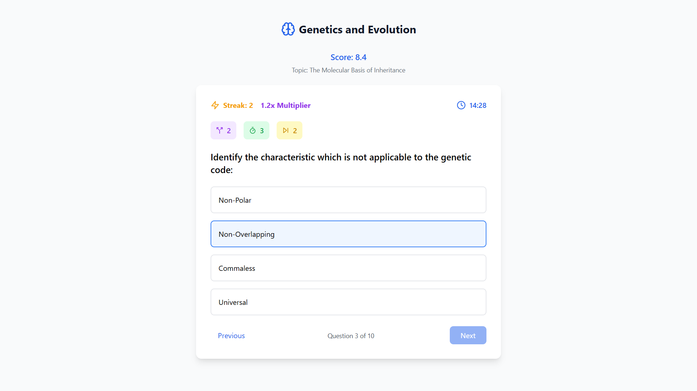
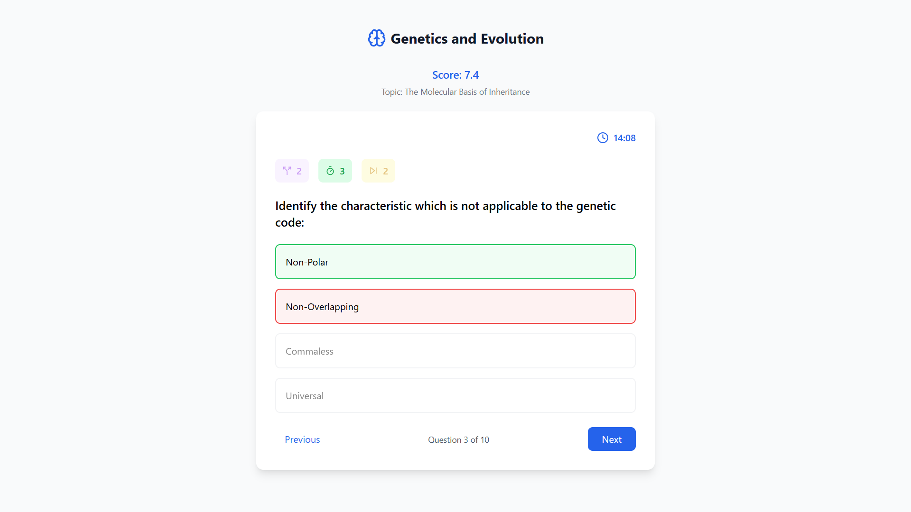
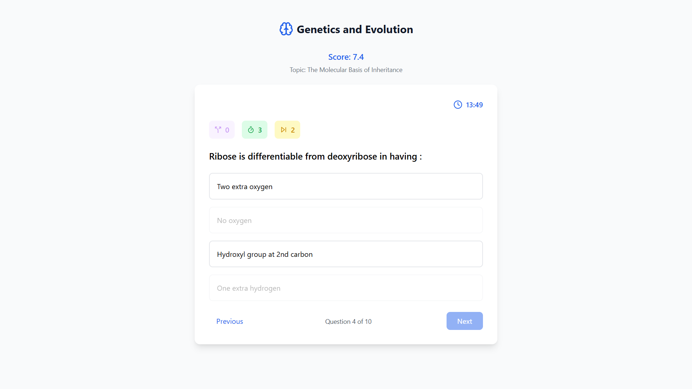
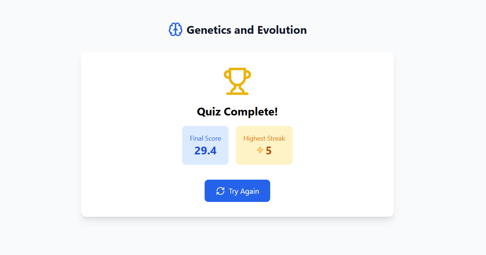

# 🎯 Quiz Application
A web-based quiz application with gamification features, fetching quiz data from an API and presenting it through an intuitive and engaging user interface.

## 🚀 Features
- Fetches quiz data dynamically from an API.
- Multiple-choice questions with real-time scoring.
- **Power-Ups**: 50-50, Time Bonus, and Skip Question.
- **Gamification Elements**: Streaks and multipliers to enhance engagement.
- **Automatic Quiz Submission** when time runs out.
- Fully responsive and optimized UI using **Vite, React, TailwindCSS, and Lucide Icons**.

## 📷 Screenshots
**Quiz Page**



**Wrong Answer**



**Remove two incorrect options**



**Result Page**



## 🛠️ Tech Stack
- **Frontend**: React (with Vite), Tailwind CSS, Lucide Icons
- **State Management**: React Hooks
- **API Integration**: Fetch API
- **Deployment**: Netlify

## 🔧 Installation & Setup
1. **Clone the repository**
   ```bash
   git clone https://github.com/tapas-code/quiz.com.git
   cd your-repo
   ```

2. **Install dependencies**
   ```bash
   npm install
   ```

3. **Run the development server**
   ```bash
   npm run dev
   ```

4. **Build for production**
   ```bash
   npm run build
   ```

## 🌐 Deployment
The app is deployed on **Netlify**. You can access it here:
👉 **[Live Demo](https://quiz-asgn.netlify.app/)**

## 🛠️ Configuration
The API URL is handled dynamically to support both development and production:
```tsx
const API_BASE_URL = import.meta.env.MODE === 'development'
  ? '/api'
  : 'https://api.allorigins.win/get?url=https://api.jsonserve.com';
```

## 🐞 Troubleshooting
- If API requests fail due to **CORS issues**, ensure you're using the correct proxy or deploy your own CORS proxy.
- If the quiz **does not load** after deployment, verify that API requests are being made correctly.

## 📜 License
This project is open-source under the **MIT License**.

---

### ✨ Special Thanks
- **Vite** for a fast development experience.
- **Tailwind CSS** for making styling effortless.
- **Lucide Icons** for beautiful UI elements.

💡 Feel free to contribute by submitting issues or pull requests! 🚀

